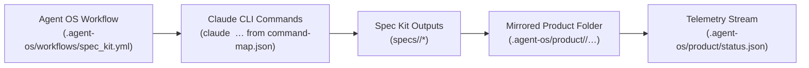

# Agent OS Integration Architecture

## Overview
Agent OS coordinates the Spec Kit feature workflow by dispatching predefined prompts and commands into Claude Code RiskExec. The integration hinges on three contracts:

1. **Workflow orchestration** defined in `.agent-os/workflows/spec_kit.yml`, which enumerates each Spec Kit phase and the Agent OS command alias that should be executed.
2. **Command resolution** supplied by `.agent-os/command-map.json`, mapping Agent OS aliases back to the canonical Claude CLI commands (for example, `/specify`, `/plan`, `/tasks`).
3. **Artifact mirroring** performed by the Spec Kit workflow runners (see `scripts/runSpecKitWorkflow.js` and `src/workflowOrchestrator.ts`), which copy every generated deliverable into `.agent-os/product` so the Agent OS desktop client can surface the latest outputs and telemetry.

Together, these contracts allow Agent OS to trigger Claude Code, watch command progress in the CLI, and present a synchronized view of the resulting specification, plan, tasks, implementation artifacts, and QA data.

## Repository Layout for Agent OS
The integration artifacts live under a dedicated `.agent-os` directory at the repository root:

```text
.agent-os/
├── workflows/spec_kit.yml
├── command-map.json
├── instructions/core/
└── product/
```

* `.agent-os/workflows/spec_kit.yml` – Primary workflow definition that Agent OS executes.
* `.agent-os/command-map.json` – Generated command lookup aligning Agent OS aliases with Claude CLI commands.
* `.agent-os/instructions/core/` – Phase-specific prompt snippets (e.g., `specify.mdc`, `plan.mdc`).
* `.agent-os/product/` – Mirrored deliverables (specs, plans, tasks, implementation logs, telemetry JSON) consumed by the Agent OS client.

## Workflow Flow Diagram


## Running a Feature Workflow via Agent OS
1. **Regenerate the command map when workflow metadata changes.**
   ```bash
   npm run agentos:command-map
   ```
2. **Validate the workflow configuration before triggering Agent OS.** This ensures that every phase listed in `spec_kit.yml` resolves to an existing CLI command, instruction file, and output path.
   ```bash
   npm run agentos:verify
   ```
3. **Launch the Spec Kit workflow with Agent OS aliases enabled.** Set `SPEC_KIT_AGENT_OS_MODE=1` so `scripts/runSpecKitWorkflow.js` reads `.agent-os/command-map.json` and invokes the exact aliases defined in Agent OS.
   ```bash
   SPEC_KIT_AGENT_OS_MODE=1 node scripts/runSpecKitWorkflow.js Feature-A "Short feature brief"
   ```
4. **Monitor mirrored artifacts.** Each phase writes to `specs/Feature-A/*` and mirrors the same files into `.agent-os/product/Feature-A/specs/Feature-A/*`. The orchestrator also appends a telemetry entry to `.agent-os/product/status.json` for downstream analytics.
5. **Open the Agent OS desktop client.** Point the client at your repository root so it can read `.agent-os/product`, load the mirrored Markdown files, and display progress for the current feature.

## Example Workflow Execution Output
```text
$ SPEC_KIT_AGENT_OS_MODE=1 node scripts/runSpecKitWorkflow.js Feature-A "Payment portal revamp"
[workflow] Starting workflow for Feature-A
[workflow:agent-os] Agent OS command aliases enabled for Spec Kit workflow.
[workflow:specify] Executing claude /create-spec Feature-A "Payment portal revamp"
[workflow:specify] Phase complete
[workflow:plan] Executing claude /derive-plan Feature-A
[workflow:plan] Phase complete
[workflow:tasks] Executing claude /enumerate-tasks Feature-A
[workflow:tasks] Phase complete
[workflow:implement] Implementing task 1/3: Scaffold payment form
[workflow:implement] Executing claude /execute-implementation Feature-A "Scaffold payment form"
[workflow:tests] Running tests: npm test -- --watch=false
[workflow:implement] Phase complete
[workflow:verify] Executing claude /qa-verify Feature-A
[workflow:verify] QA review triggered
[workflow] Workflow completed successfully.
```

## Troubleshooting
* **Missing mirrored files in `.agent-os/product`.** Confirm `src/workflowOrchestrator.ts` is writing to the mirror by re-running `npm run agentos:verify`; this script flags phases whose expected outputs or mirror paths drift from `spec_kit.yml`.
* **Mismatched command aliases.** Delete `.agent-os/command-map.json` and regenerate it with `npm run agentos:command-map` whenever you rename a CLI command or Agent OS alias. The verification script compares the generated structure with the workflow.
* **Agent OS cannot locate instructions.** Ensure every phase in `spec_kit.yml` references an existing `.agent-os/instructions/core/*.mdc` file and that the file casing matches the entry in YAML.
* **Telemetry is stale.** The orchestrator appends telemetry objects to `.agent-os/product/status.json`. If the file becomes corrupted, delete it and rerun the workflow to regenerate a fresh timeline.

## Mirrored Product Folder Preview
After running a workflow with Agent OS mirroring enabled you should see a synchronized directory tree similar to the following:

```text
.agent-os/product/
└── Feature-A/
    ├── specs/
    │   └── Feature-A/
    │       ├── specification.md
    │       ├── plan.md
    │       ├── tasks.md
    │       └── implementation.md
    ├── tests/
    │   └── summary.json
    └── status.json
```

Each mirrored artifact mirrors a canonical source file under `specs/Feature-A/*`. The `status.json` file accumulates telemetry events emitted by `src/workflowOrchestrator.ts`, giving the Agent OS desktop client real-time visibility into workflow progress without requiring any binary assets in the repository.
